<h1 align="center" style="margin: 0 auto 0 auto;">  Program Trading Based on Webull</h1>
<h4 align="center" style="margin: 0 auto 0 auto;">Market data from Webull and Yahoo! Build your own strategy, let the program trade for you with your Webull account.</h4>

 

## ⚠️ 0. Disclaimer and Security
- This App is not affiliated with Webull Financial LLC.
- The webull API used in this App is from: 
  - https://pypi.org/project/webull/ (Pypi.org)
  - https://github.com/tedchou12/webull (Github, by tedchou12)
- The official [Webull API](https://github.com/webull-inc/openapi-python-sdk) is still under testing. This App will switch to the official API when it is ready.
- The App GUI is developed via [Tkinter-Designer](https://github.com/ParthJadhav/Tkinter-Designer), an easy and fast way to create a Python GUI.

 

- For security:
  - Do **not** save your username, password, and PID locally. Keep it safe.
  - Do **not** upload or share the credential Json files generated by App.
  - The `access_token` will expire weekly, you need to re-log in to set up a new one.

 

- If you don't have Webull account, feel free to use my [referral link](https://www.webull.com/ko-yield/1686282581612-6819bd?__app_cfg__=%7B%22supportTheme%22%3Atrue%7D&inviteCode=vxXUIqoQXd1E&source=hdx) to sign up, you can get 12 free stocks depositing $0.01 or more.

 

- Feel free to fork and edit the code to customize the App for your own use.

 

## 🤖 1. Install

### 🐍 1.1 Install Python

Use the link below to download and install Python. (Make sure to add Python to your system PATH during the installation)

https://www.python.org/downloads/   

### 💾 1.2 Clone this repository
`git clone https://github.com/LukeWang01/Program-Trading-Based-on-Webull.git`

or,

Download the Zip file and unzip to a folder.

### 💽 1.3 Install the required packages:

`pip install -r requirements.txt`

or,

`pip3 install -r requirements.txt`

[If got errors when installing (click here)](docs/first_run_setup.md)

 

## 🚀 2. Run

### 2.1 Launch the App

Go to the Program-Trading-Based-on-Webull folder, open the terminal,

`python app.py`

or,

Double-click the `app_launcher.bat` to run. (Windows only)

 

 

 

### 2.2 First time launch setup (Setup only once for the Authentication)

[Instructions for the first run setup (click here)](docs/first_run_setup.md)

 

## 💲 3. Build your own strategy

You can create your strategy following the example strategy:

`Program-Trading-Based-on-Webull/strategy/My_Strategy.py`

(https://github.com/LukeWang01/Program-Trading-Based-on-Webull/blob/main/strategy/My_Strategy.py)

 

Just to override the `strategy_decision()` function in `My_Strategy` class, and add any attributes you need.

 

Run your strategy and make tradings after log in:

 

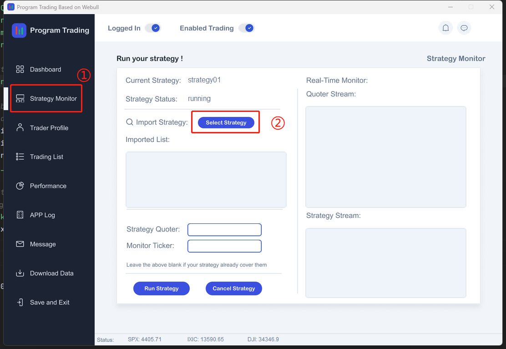

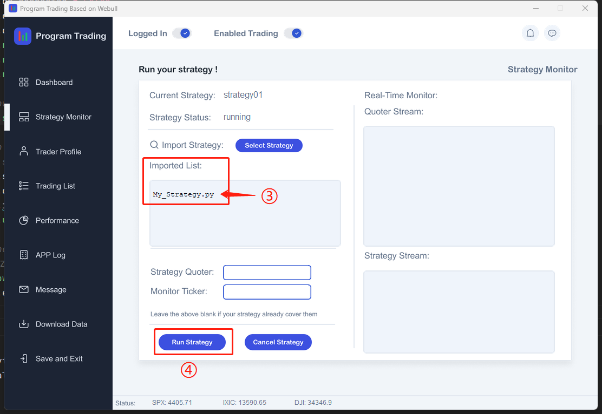

 

## 🖥️ 4. App Features

##### 4.1 Log in
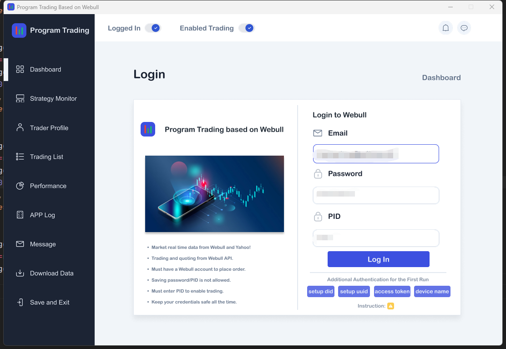

##### 4.2 Account Dashboard
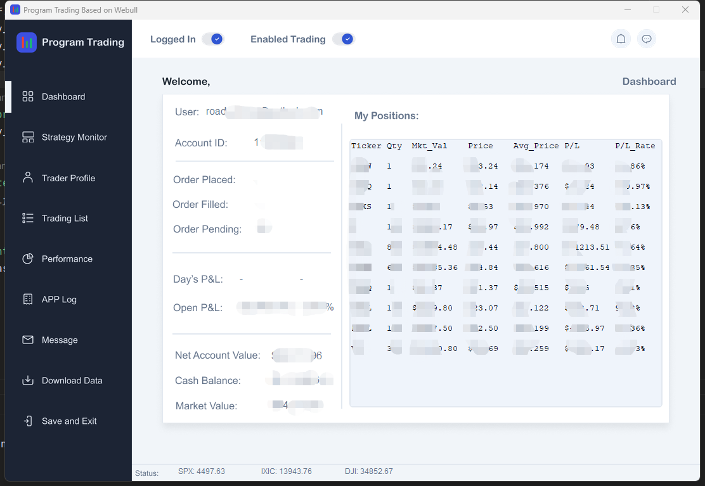

##### 4.3 Select and run strategy, monitor the market and strategy
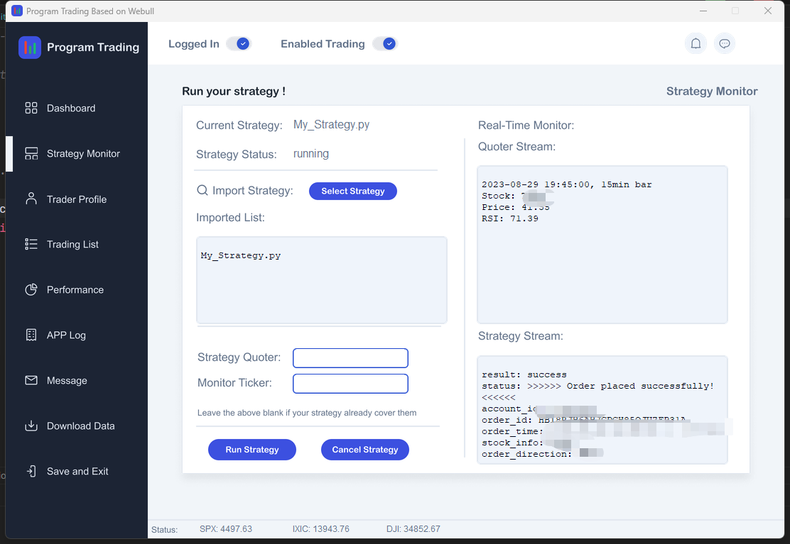

##### 4.4 Edit your profile settings, add notification email account
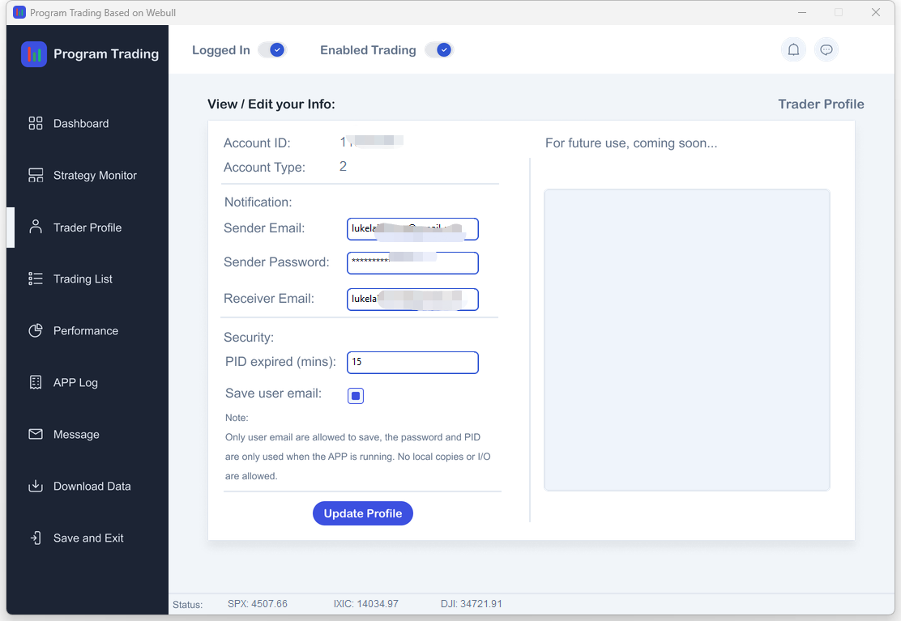

##### 4.5 View the trading orders and transaction history
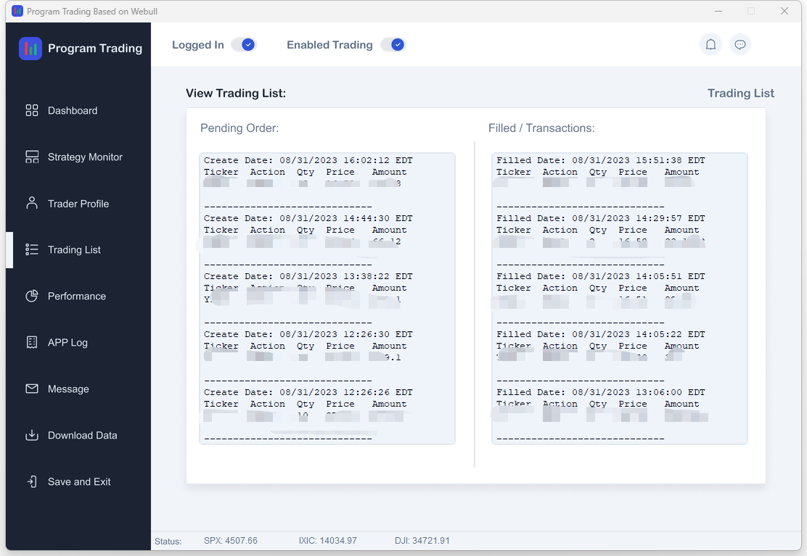

##### 4.6 View the performance of your strategy or account
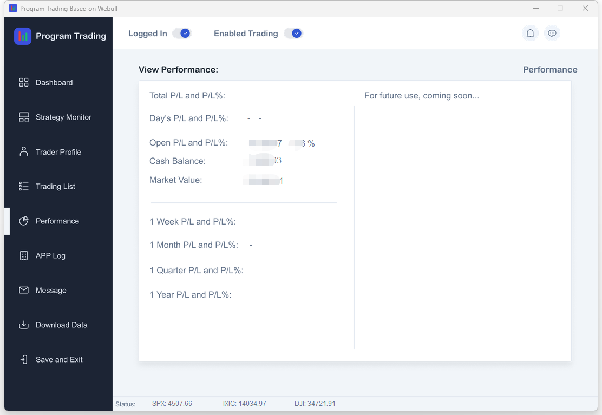

##### 4.7 View the App running log
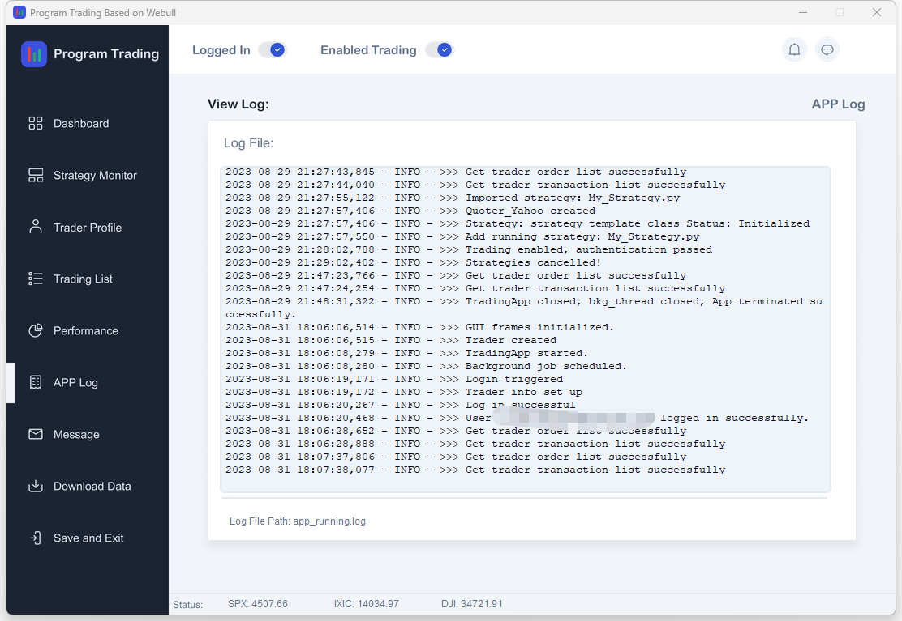

##### 4.8 Edit the notification email account settings
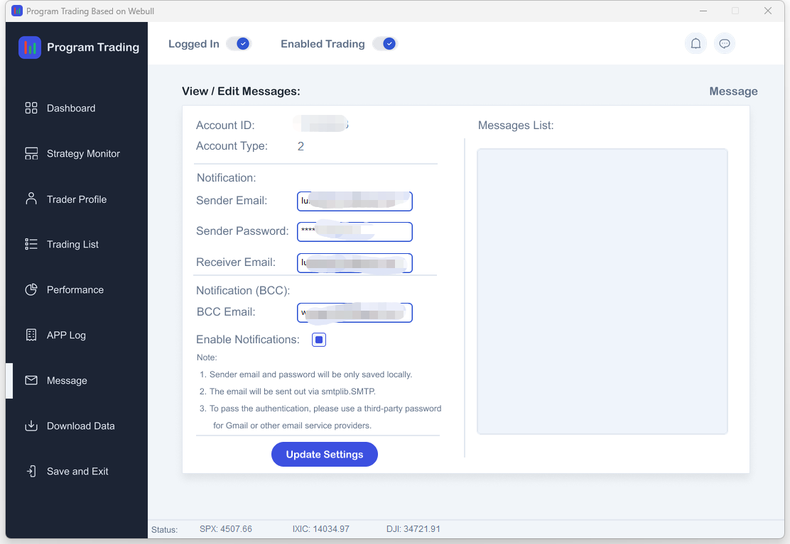

##### 4.9 Download the stock intraday and history data, saving as csv file
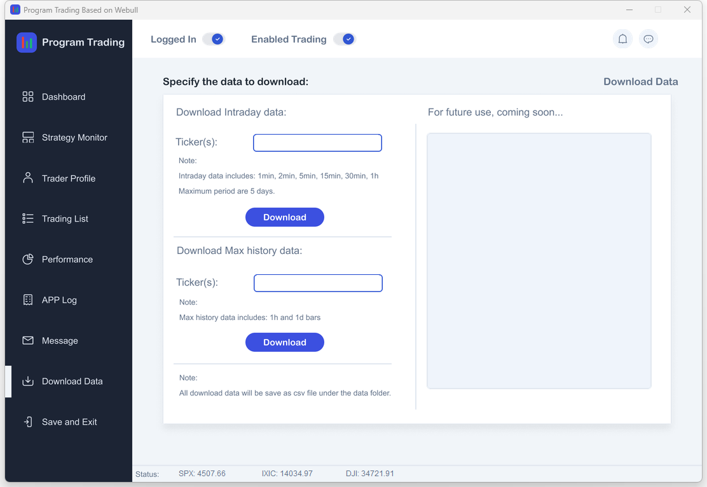

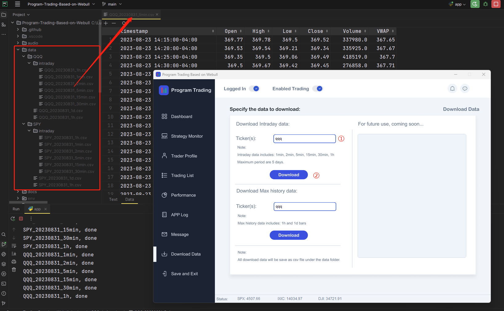

##### 4.10 Safe exit the App
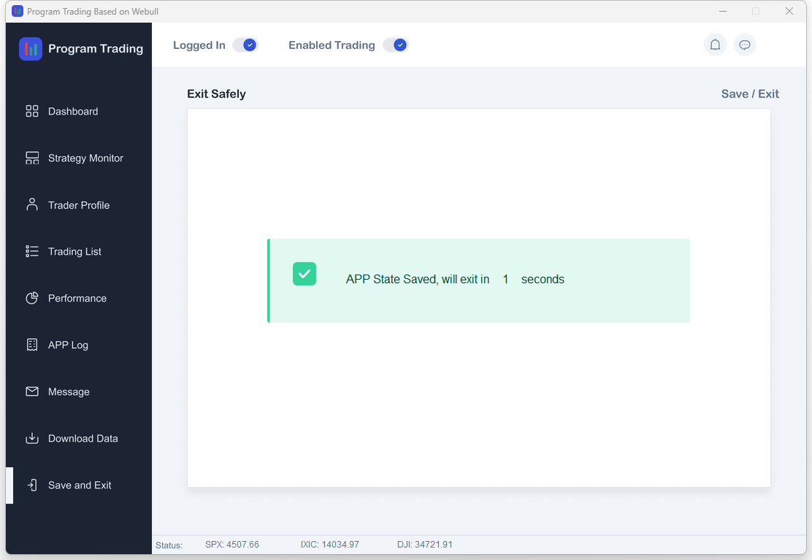

 

 

 

#### Feel free to edit the code to customize the App for your own use.

 

Good luck to all traders!

Luke

