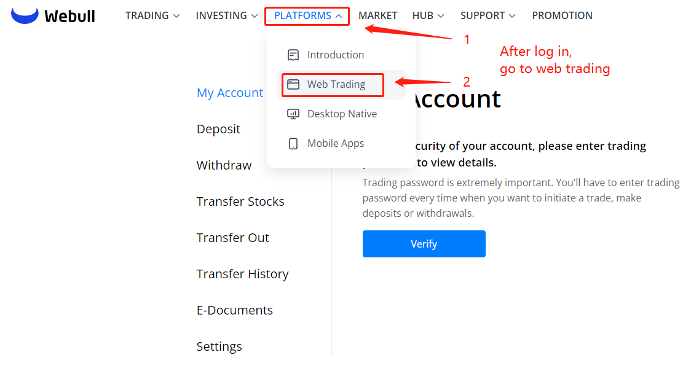
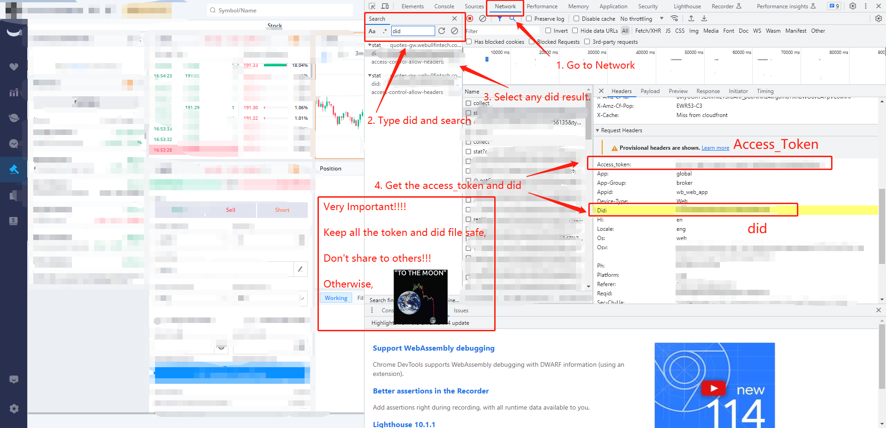
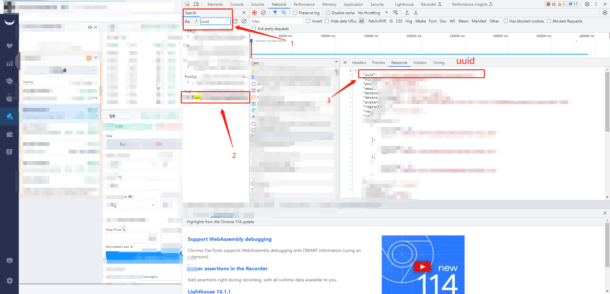
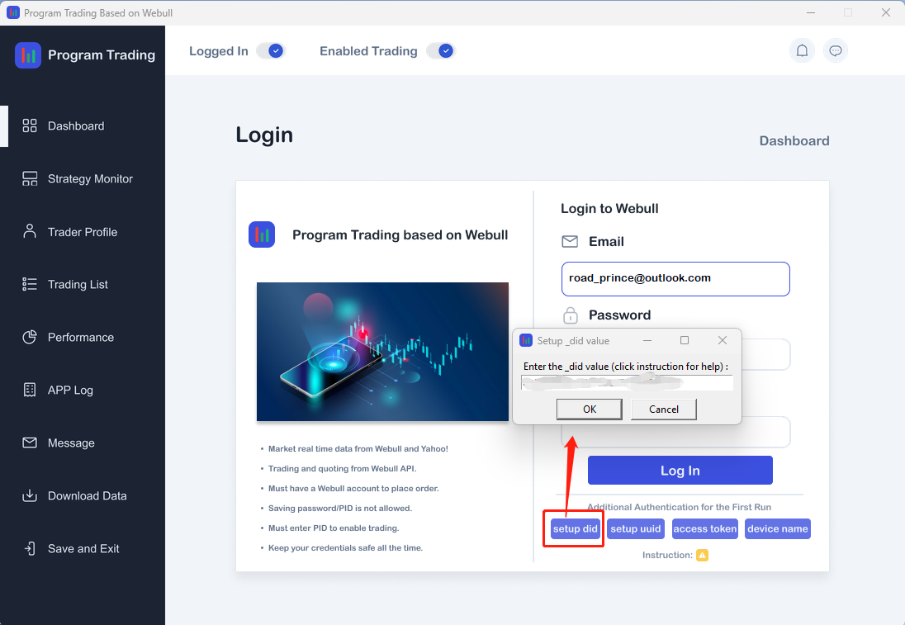

## First time launch setup (Setup only once for the Authentication

### 1. Log in to the Webull official website and go to web tradeing page:
 

 

### 2. Get the uuid, did, access_token from the developing mode:

Then, go to the developing mode (press F12, or right click and select inspect):

 

 

Follow the instructions above, you can get the:

`did`, `uuid`, `access_token`

For `device name`, you can name it by yourself, such as `my_pc`.

Then, setup these vaules before log in:

 

 