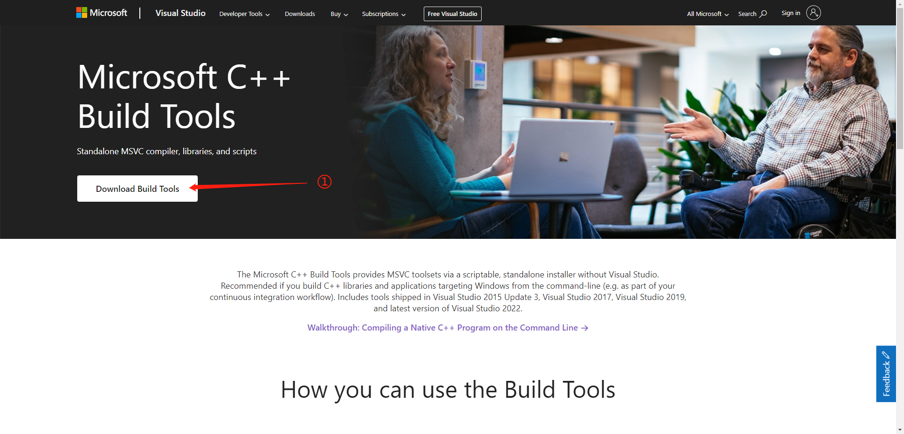
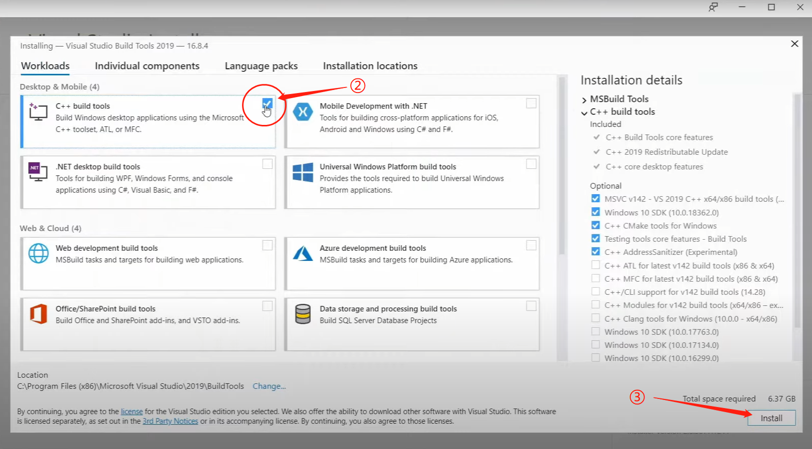

If you got errors to install the `simpeaudio` library, you can try the following steps:

1.  Go to https://visualstudio.microsoft.com/visual-cpp-build-tools/
2.  Download the C++ Build Tools Installer
3.  Run the installer and install the C++ Build Tools

After install, try:

`pip install simpleaudio`

or,

`pip install -r requirements.txt`

or,

`pip3 install -r requirements.txt`

 

